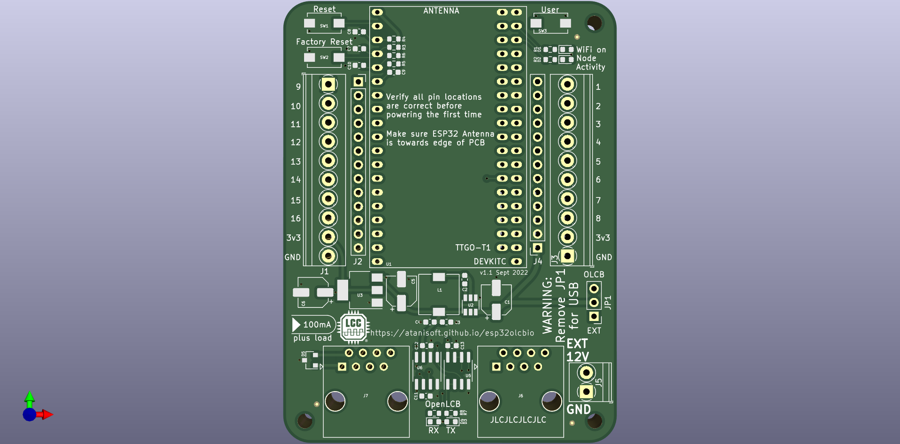

# ESP32 OpenLCB IO Board

The ESP32 OpenLCB IO Board is a basic OpenLCB (LCC) node offering 14 input/output
capable pins, and two that are input only. Additionally all IO pins are exposed
through two 13 pin headers which allows for extending the functionality of 
the base board using a daughter board approach.

## Powering the ESP32 OpenLCB IO Board

The ESP32 OpenLCB IO Board can be powered from an external power supply (12V) on
J5 connector, or using the OpenLCB (LCC) Bus power on RJ45. To enable powering
from the external supply, bridge pins 1 and 2 on JP1. To power from the OpenLCB
(LCC) Bus, bridge pins 2 and 3. Note that when using the USB connector on the
ESP32 module JP1 should not have any pins bridged.

### OpenLCB (LCC) Power requirements

The ESP32 OpenLCB IO Board will draw around 100mA from the OpenLCB (LCC) Bus when
the PWR_POS pin provides 15VDC. If the PWR_POS pin provides less, the node may
draw more current from the bus.

### External Power requirements

The external power supply should be rated for at least 12VDC 500mA to ensure
sufficient current is available for the node to operate as intended.

### Node Brownout detection

If the ESP32 detects a brownout condition it will attempt to produce the
well-known event `01.00.00.00.00.00.FF.F1` soon after startup. This delivery
is not guaranteed.

## Pin Mapping

By default almost all pins are exposed for general IO usage by the node,
however a few pins have specialized usage as part of the screw terminals or
expansion headers.

| GPIO Pin | Usage | Notes |
| -------- | ----- | ----- |
| 0 | IO4 | has pull-up resistor |
| 1 | UART0 TX | not exposed |
| 2 | IO5 | has pull-down resistor |
| 3 | UART0 RX | not exposed |
| 4 | CAN RX | has pull-down resistor |
| 5 | CAN TX | has pull-up resistor |
| 6-11 | NOT AVAILABLE | connected to on chip flash |
| 12 | IO7 | has pull-down resistor |
| 13 | IO8 | |
| 14 | IO16 | |
| 15 | IO6 | has pull-up resistor |
| 16 | IO3 | |
| 17 | IO2 | |
| 18 | IO1 | |
| 19 | I2C - SDA | |
| 20 | NOT AVAILABLE | NOT AVAILABLE |
| 21 | I2C - SCL | |
| 22 | Node Activity LED | active low |
| 23 | WiFi Active LED | active low |
| 24 | NOT AVAILABLE | NOT AVAILABLE |
| 25 | IO13 | |
| 26 | IO14 | |
| 27 | IO15 | |
| 28-31 | NOT AVAILABLE | NOT AVAILABLE |
| 32 | IO11 | |
| 33 | IO12 | |
| 34 | IO9 | INPUT ONLY, has pull-up resistor |
| 35 | IO10 | INPUT ONLY |
| 36 (SVP) | User button | INPUT ONLY, has pull-up resistor |
| 37 | NOT AVAILABLE | NOT AVAILABLE |
| 38 | NOT AVAILABLE | NOT AVAILABLE |
| 39 (SVP) | Factory Reset button | INPUT ONLY, has pull-up resistor |

### Input only pins

The four pins marked as INPUT ONLY in the table above have a 10k pull-up to
3v3 and a 100nF capacitor for debounce.

### IO4, IO5, IO6, IO7 Usage Note

IO4 and IO6 typically have a pull-up resistor. IO5 and IO7 typically have a
pull-down resistor that can not be disabled. Keep this in mind as this may
require adjustments to usage patterns.

## Base ESP32 OpenLCB IO PCB

The ESP32 OpenLCB IO Board PCB can be found under the pcb directory and is
provided as both KiCad files and generated Gerber files.

### PCBWay project

The ESP32 OpenLCB IO PCB has been shared via PCBWay [here](https://www.pcbway.com/project/shareproject/ESP32_OpenLCB__LCC__IO_PCB.html).

### Mouser BOM

The ESP32 OpenLCB IO Board components have been entered on Mouser for easy ordering
via the following shared carts:
- [single PCB](https://www.mouser.com/ProjectManager/ProjectDetail.aspx?AccessID=6d57d6cf6a)
- [five PCBs](https://www.mouser.com/ProjectManager/ProjectDetail.aspx?AccessID=a15be25217)

Ordering in larger quantities can decrease the per-PCB cost considerably. In
the case of resistors and capacitors it is recommended to order 100 of each
as they are tiny and easily lost. Other parts can often be substituted as long
as they have the same footprint and pinout. The pin headers will need to be cut
to length in both of the carts above, in the case of the five PCBs option there
should be enough to populate all five PCBs for the ESP32 *AND* the extension
board (when available).

#### Optional parts

The following parts are optional depending on board usage:

| Part | Mouser # | Notes |
| ---- | -------- | ----- |
| J2, J4 | 571-6-534237-1 | These are only needed for attaching an extension daughter board. |
| J5 | 523-NY0210800000G | This is only required if using an external power supply. |

#### Alternative part numbers

The following parts have compatible alternatives:

| Part | Default Mouser # | Alternative Mouser # | Notes |
| ---- | ---------------- | -------------------- | ----- |
| J2, J4 | 571-6-534237-1 | 992-13FX1-254MM, 485-598, 485-4158, 485-4156, 485-4159, 485-4157, 485-4155, 485-4160 | Parts 485-XXXX will need to be cut to the correct length. |
| J6, J7 | 571-5569284-1 | 534-949 or 493-HCJV1-812UK |

## Extending the base board

The ESP32 OpenLCB IO Board can be extended by using the pcb-ext daughter board
files as a basis for creating a compatible extension PCB. This PCB sits on top
of the base board.

### 16 Channel PWM generator expansion

The first expansion board is the 16 Channel PWM generator board, this is usable
for Servo or LED control. This expansion board utilizes a PCA9685 to generate
16 PWM signals which are routed to a three pin header (GND, 5V and PWM) for
each output.

### Single character display example

While not entirely practical for most use cases, this shows one example of
creating a single character display using a 5x7 grid of WS2812 (or similar)
addressable LEDs connected in series to a single IO pin on the base board.
Design files are not available for this at this time.

