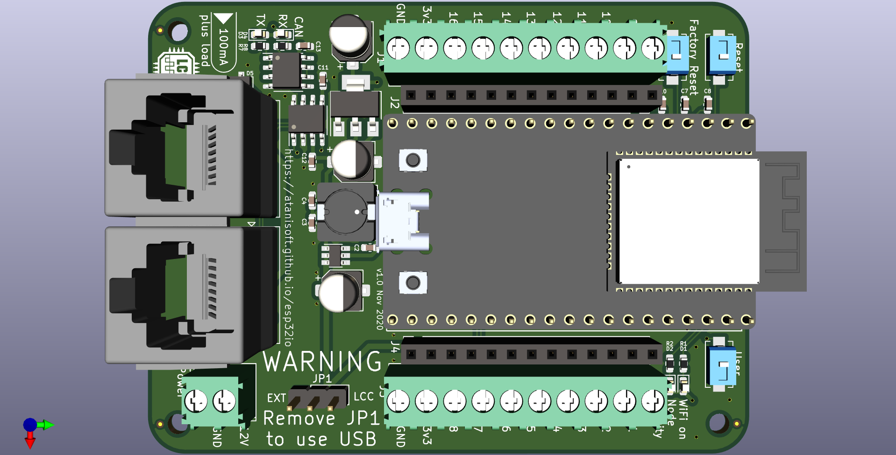

# What is the Esp32OlcbIO
The Esp32OpenLCBIO Board is a basic OpenLCB (LCC) node offering 14 input/output
capable pins, and two that are input only. Additionally all IO pins are exposed
through two 13 pin headers which allows for extending the functionality of 
the base board using a daughter board approach.

## Features

* Compact size (approximately 81x61mm)
* Powered by the OpenLCB (LCC) bus, drawing up to 100mA of current.
* Optionally powered by an external power supply (12-15v DC, 500mA)
* Firmware update over USB or OpenLCB (LCC).

## Pin Mapping

By default almost all pins are exposed for general IO usage by the node,
however a few pins have specialized usage as part of the screw terminals or
expansion headers.

| GPIO Pin | Usage | Notes |
| -------- | ----- | ----- |
| 0 | IO4 | has pull-up resistor |
| 1 | UART0 TX | not exposed |
| 2 | IO5 | has pull-down resistor |
| 3 | UART0 RX | not exposed |
| 4 | CAN RX | has pull-down resistor |
| 5 | CAN TX | has pull-up resistor |
| 6-11 | NOT AVAILABLE | connected to on chip flash |
| 12 | IO7 | has pull-down resistor |
| 13 | IO8 | |
| 14 | IO16 | |
| 15 | IO6 | has pull-up resistor |
| 16 | IO3 | |
| 17 | IO2 | |
| 18 | IO1 | |
| 19 | I2C - SDA | |
| 20 | NOT AVAILABLE | NOT AVAILABLE |
| 21 | I2C - SCL | |
| 22 | Node Activity LED | active low |
| 23 | WiFi Active LED | active low |
| 24 | NOT AVAILABLE | NOT AVAILABLE |
| 25 | IO13 | |
| 26 | IO14 | |
| 27 | IO15 | |
| 28-31 | NOT AVAILABLE | NOT AVAILABLE |
| 32 | IO11 | |
| 33 | IO12 | |
| 34 | IO9 | INPUT ONLY, has pull-up resistor |
| 35 | IO10 | INPUT ONLY |
| 36 (SVP) | User button | INPUT ONLY, has pull-up resistor |
| 37 | NOT AVAILABLE | NOT AVAILABLE |
| 38 | NOT AVAILABLE | NOT AVAILABLE |
| 39 (SVP) | Factory Reset button | INPUT ONLY, has pull-up resistor |

### Input only pins

The four pins marked as INPUT ONLY in the table above have a 10k pull-up to
3v3 and a 100nF capacitor for debounce.

### IO4, IO5, IO6, IO7 Usage Note

IO4 and IO6 typically have a pull-up resistor. IO5 and IO7 typically have a
pull-down resistor that can not be disabled. Keep this in mind as this may
require adjustments to usage patterns.
